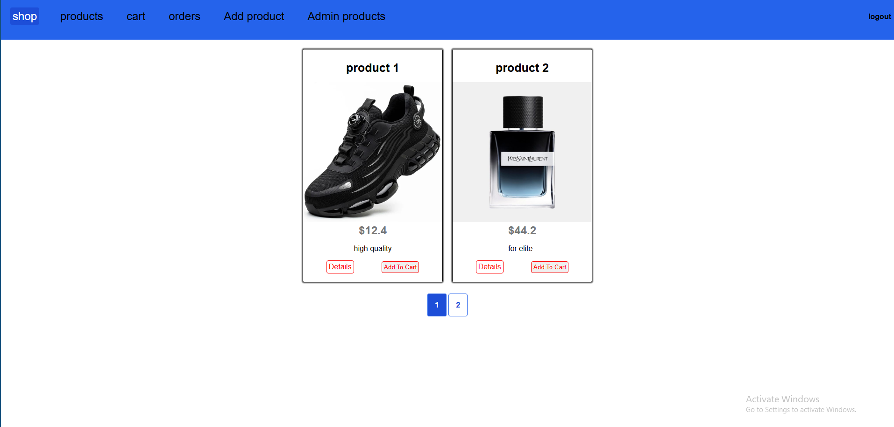

# Node.js Mongoose E-Commerce

A full-stack e-commerce application built with Node.js, Express.js, MongoDB, Mongoose, and EJS.

## 🌐 Live Demo
[Click Here]()

## 📸 Preview



## Features

* User registration and login
* Session-based authentication
* MongoDB session storage
* Password hashing with bcrypt
* Password reset with email notifications
* Role-based admin authorization
* Product CRUD operations
* Product image uploads with Multer
* Product validation with Express Validator
* CSRF protection
* Shopping cart management
* Order creation and order history
* Product pagination
* PDF invoice generation
* Order ownership authorization
* Flash messages
* Custom 404 and 500 error handling

## Tech Stack

* **Node.js**
* **Express.js**
* **MongoDB**
* **Mongoose**
* **EJS**
* **Express Session**
* **MongoDB Session Store**
* **bcryptjs**
* **Express Validator**
* **Multer**
* **Nodemailer**
* **SendGrid**
* **PDFKit**
* **CSRF**
* **dotenv**

## Project Structure

```text
nodejs-mongoose-ecommerce/
│
├── controllers/
│   ├── admin.js
│   ├── auth.js
│   ├── error.js
│   └── shop.js
│
├── middleware/
│   ├── is-admin.js
│   └── is-auth.js
│
├── models/
│   ├── order.js
│   ├── product.js
│   └── user.js
│
├── routes/
│   ├── admin.js
│   ├── auth.js
│   └── shop.js
│
├── util/
│   ├── database.js
│   └── file.js
│
├── views/
│   ├── admin/
│   ├── auth/
│   ├── shop/
│   ├── 404.ejs
│   └── 500.ejs
│
├── public/
├── images/
├── data/
├── app.js
├── package.json
└── .env
```

## Application Flow

```text
Authentication
     │
     ▼
   User
     │
     ├── Browse Products
     │
     ├── Add to Cart
     │       │
     │       ▼
     │    Checkout
     │       │
     │       ▼
     │    Create Order
     │
     └── View Orders
             │
             ▼
        PDF Invoice


Admin
  │
  ├── Add Product
  ├── Edit Product
  ├── Delete Product
  └── Manage Products
```

## Authentication

The application uses session-based authentication with sessions stored in MongoDB.

Passwords are hashed using `bcryptjs` before being stored in the database.

Authentication includes:

* Signup
* Login
* Logout
* Password reset
* Session management
* Protected routes

## Authorization

The application implements role-based authorization using an `isAdmin` property on the user.

Protected admin routes require both:

```text
isAuth
   ↓
isAdmin
   ↓
Controller
```

Users can also access only their own orders and invoices.

## Product Management

Administrators can:

* Create products
* Edit products
* Delete products
* Upload product images
* Replace product images

Product data is stored in MongoDB through Mongoose.

Each product references its owner using a MongoDB ObjectId.

## Shopping Cart

Users can:

* Add products to their cart
* Increase product quantity
* Remove products
* Clear the cart after creating an order

Cart items reference products using Mongoose references and are populated when required.

## Orders

When an order is created:

1. The user's cart is populated with product data.
2. Products and quantities are copied into a new order.
3. The order is saved in MongoDB.
4. The user's cart is cleared.
5. The user is redirected to the orders page.

Users can only access their own orders.

## Pagination

Product listings implement server-side pagination using MongoDB:

```text
skip()
limit()
```

The application provides:

* Current page
* Previous page
* Next page
* Last page
* Pagination availability

## Image Uploads

Product images are handled using Multer.

Supported formats:

```text
PNG
JPG
JPEG
```

Images are stored in the `images` directory.

Old product images are removed when products are updated or deleted.

## Password Reset

The password reset system uses:

* Cryptographically generated reset tokens
* Token expiration
* Email notifications
* bcrypt password hashing

After a successful password reset, the reset token is removed.

## PDF Invoices

Orders can be converted into PDF invoices using PDFKit.

Invoices contain:

* Product names
* Quantities
* Product prices
* Line totals
* Total order price

Invoice access is restricted to the owner of the order.

## Environment Variables

Create a `.env` file in the project root:

```env
MONGO_USER=your_mongodb_username
MONGO_PASSWORD=your_mongodb_password
SESSION_SECRET=your_session_secret
SENDGRID_API_KEY=your_sendgrid_api_key
PORT=5000
```

Never commit `.env` to the repository.

## Installation

Clone the repository:

```bash
git clone https://github.com/YOUR_USERNAME/nodejs-mongoose-ecommerce.git
```

Navigate to the project:

```bash
cd nodejs-mongoose-ecommerce
```

Install dependencies:

```bash
npm install
```

Create and configure the `.env` file.

Then start the application:

```bash
npm start
```

For development with Nodemon:

```bash
npm run dev
```

The application runs by default on:

```text
http://localhost:5000
```

## Security

The application includes several security-related mechanisms:

* Password hashing with bcrypt
* Session-based authentication
* CSRF protection
* Input validation
* Admin authorization
* Order ownership validation
* Environment variables for sensitive credentials

Sensitive files should not be committed:

```gitignore
node_modules/
.env
```

## Future Improvements

* REST API
* Product search and filtering
* Product categories
* Payment integration
* Order status management
* Automated tests
* Cloud image storage
* Docker support
* Improved production logging
* TypeScript migration

## License

This project was developed for educational and portfolio purposes.
